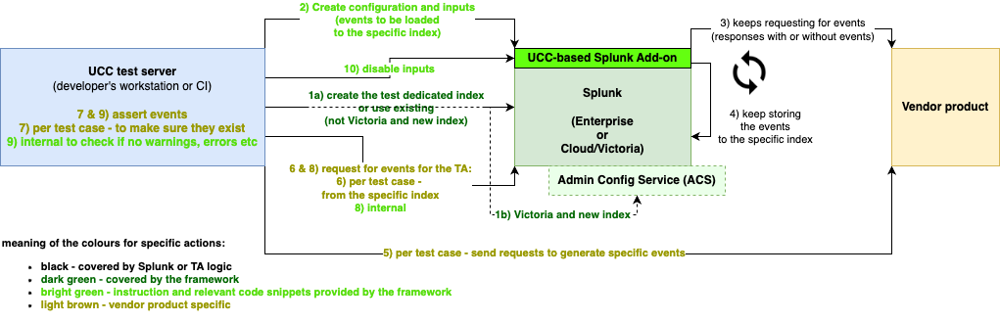

# addonfactory-ucc-test pytest plugin

addonfactory-ucc-test plugin extendst [pytest](https://pytest.org/) to support [end-to-end Splunk add-ons flow](#action-diagram).

It comes with libraries that cover standard Splunk (Enterprise and Cloud) functionalities as well as general UCC functionalities, such as:

- indexes creation

- searching

- common configuration and inputs management

Relevant [environment variables](#expected-environment-variables) have to be defined to benefit from the functionalities.

The plugin requires vendor product specific and add-on specific functionalities to be covered by add-on developer.
This includes specifying environment variables that include information about vendor product address, user that should be used to generate events or user that should be used for integration.

## Expected environment variables

Information about Splunk has to be given in relevant environment variables:

- **MODINPUT_TEST_SPLUNK_HOST** - Splunk Enterprise IP or domain address or Splunk Cloud domain address (eg. `127.0.0.1`, `localhost` or `test.splunkcloud.com`). `https` protocol is used for connection and ssl verification is skipped to support developer and test Splunk instances.

- **MODINPUT_TEST_SPLUNK_PORT** - management port (`8089` in most cases)

- **MODINPUT_TEST_SPLUNK_USERNAME** - Splunk admin username (`admin` in most cases) that will be used for tests

- **MODINPUT_TEST_SPLUNK_PASSWORD_BASE64** - base64 encoded Splunk user used for tests password  (eg. `Q2hhbmczZCE=`  as a result of `ucc-test-modinput base64encode -s 'Chang3d!'`; check [ucc-test-modinput documentation](./ucc-test-modinput_cli_tool.md) for more)

- ***(optional) MODINPUT_TEST_SPLUNK_DEDICATED_INDEX*** - existing index name that should be used to write test events. If not defined, dedicated index is created for each test run and used for the same purpose.

- *(depreciated) MODINPUT_TEST_SPLUNK_INDEX_LOCK*

- following variables are required only if **Splunk Cloud** is used for tests **and any index needs to be created** for tests:

    - **MODINPUT_TEST_SPLUNK_TOKEN_BASE64** - base64 encoded [Splunk Cloud authentication token](https://docs.splunk.com/Documentation/SplunkCloud/latest/Security/CreateAuthTokens)

    - **MODINPUT_TEST_ACS_SERVER** -  [ACS server](https://docs.splunk.com/Documentation/SplunkCloud/latest/Config/ACSCLI#Set_environment_variables) (eg. `https://admin.splunk.com`, `https://staging.admin.splunk.com` or `https://admin.splunkcloudgc.com`)

    - **MODINPUT_TEST_ACS_STACK** - ACS stack, that in majority of the cases will be just part of Splunk Cloud domain address (eg. for `ucc-test.stg.splunkcloud.com`, ACS server would be `https://staging.admin.splunk.com` and ACS stack `ucc-test`)

## Action diagram

<!--
https://app.diagrams.net/#G176U5PybjM_AZ2A_fMCUYRVkRoJJ4CKJp#%7B%22pageId%22%3A%22kMcs2QKimi5lbFpNUQGU%22%7D
-->

## Plugin arguments

addonfactory-ucc-test pytest plugin comes with following arguments:

- `--sequential-execution` - use no threading (for debugging)

- `--do-not-fail-with-teardown` - do not fail test if test's teardown fails. By default a test will fail if any of its forges teardowns fail, even if the test itself passed.

- `--do-not-delete-at-teardown` - do not delete created resoueces at teardown. This flag is for debug purposes and should be handled by developer if needed. For example, based on this flag developers can add alternative code to forges' teardowns, to disable inputs instead of deleting them in order to study inputs configurations after tests execution.

- `--number-of-threads=[NUMBER_OF_THREADS]` - number of threads to use to execute forges. Allowed range: [10, 20]. Default value: 10.

- `--probe-invoke-interval=[PROBE_INVOKE_INTERVAL]` - interval in seconds used to repeat invocation of yes/no type of probes. Allowed range: [1, 60]. Default value: 5.

- `--probe-wait-timeout=[PROBE_WAIT_TIMEOUT]` - maximum time in seconds given to a single probe to turn positive. Allowed range: [60, 600]. Default value: 300.

- `--bootstrap-wait-timeout=[BOOTSTRAP_WAIT_TIMEOUT]` - maximum time in seconds given to all bootstrap tasks to finish. Allowed range: [300, 3600]. Default value: 1800.

- `--attached-tasks-wait-timeout=[ATTACHED_TASKS_WAIT_TIMEOUT]` - maximum time in seconds given to finish all tasks attached to a single test. Allowed range: [60, 1200]. Default value: 600.

- `--completion-check-frequency=[COMPLETION_CHECK_FREQUENCY]` - frequency to check that bootstrap or attached tasks bundle has finished to execute. Allowed range: [1, 30]. Default value: 5.
