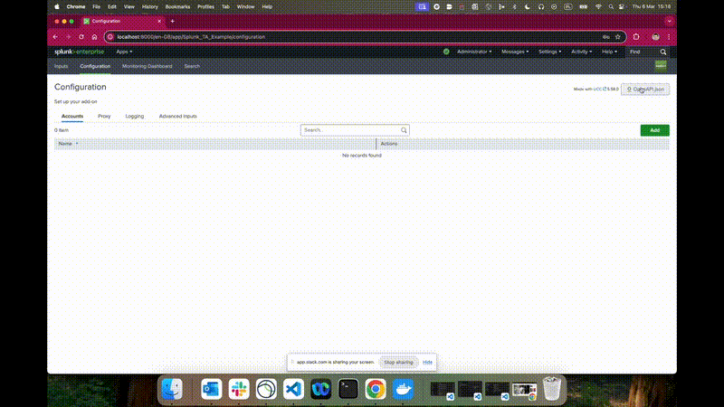

# Before you write your first line of code

AUT is a powerful toolset.

Add-on developer experience is the most important for us and we don't want you to get lost in what is available for you.

### Learn from Splunk Add-on for Example

Before you start working on your own tests, check [splunk-example-ta](https://github.com/splunk/splunk-example-ta) to get basic understanding of the example TA. Think how you would test it.

Open `tests/ucc_modinput_functional` and go through it in proposed below order to see how it is tested. Are your ideas addressed?

#### tests/ucc_modinput_functional

1. `README.md` - contains add-on specific information related to the functional tests

2. `defaults.py` - contains predefined, the tests-specific, constant values

3. `vendor/` - contains vendor product-specific code

    1. `configuration.py` - to read configuration from environment variables; it can be used later for vendor product-specific means (eg. triggering action that would generate event available for add-on to collect), add-on configuration or within test functions

    2. `client.py` - contains code used to communicate with vendor product

4. `splunk/` - contains add-on specific code

    1. `client.py` - contains code used to communicate with add-on REST API; relevant code snippets can be found in swagger_client README.md copied from there, pasted to the client file and adopted

    2. `forges.py` - contains functions responsible for creation and deletion of resources and configurations (forges); `yield` in each forge, separates setup and teardown

    3. `probes.py` - contains functions validating specific conditions used to make sure that execution of a specific forge indeed resulted in creation of expected resource.

5. `test_configuration.py` - start simple, eg. from making sure the simplest case like `test_ta_logging` works fine. Keep adding following tests for add-on configuration to make sure you are able to define building blocks that will be used for inputs

6. `test_inputs.py` - you have proper configuration. There are still two things you need to confirm:

    1. Make sure vendor product is talkative enough to have always events available for your tests or you need to trigger events generation

    2. Input forge should return spl query you will use in input probe as well as in test to get raw events for assertion

### ... also worth considering

There are components you may still want to add to your tests:

1. `vendor/` 

    1. `forges.py` - use if you want to setup and teardown resources in vendor product

    2. `probes.py`

2. `splunk/`

    1. `configuration.py` - this file is to cover values not related to vendor product, such as proxy accounts

3. `test_proxies.py` - to test proxies. Proxy configuration is general for specific add-on, so if defined it will be used for all configuration entries as well as inputs. When constructing this kind of tests you want to isolate them that can be achieved by using `attach` decorator that would group following tasks:
    
    1. making sure proxy is defined as required (or disabled if we want to test without proxy configured)

    2. relevant configuration creation - especially if validation is used that requires relevant connection to vendor product

    3. input creation

    4. etc.

4. `test_validators.py` - to test that add-on will not accept improper values for its configuration.

5. etc.

Above is just a proposition that may be relevant for small to medium add-ons.

If you find your add-on more complex, feel free to organize the test structure the way you find the most convenient and efficient.

## ucc-test-modinput init
Init command is created to save some of your efforts by doing boilerplate actions: 

- generates swagger client supporting modules, 
- creates unified tests file structure, 
- bootstraps basic splunk and vendor clients together with configuration classes, 
- initial tests with forges and probes required for them.

This command should be executed once before before any unified tests are created for the project.

1. Before invoking init command, please, make sure:

    1. [the prerequsities are met](./index.md#prerequisites)

    2. [addonfactory-ucc-test is installed](index.md#installation)

2. Run `init` to have following directories generated for you:
```console
ucc-test-modinput init
``` 

    1. `swagger_client` directory with supporting modules

    2. `tests/ucc_modinput_functional` directory with relevant files and some UCC related tests.

**Note:** You may want to specify openapi.json file location - eg. if it is in `Downloads`:
```console
ucc-test-modinput init --openapi-json ~/Downloads/openapi.json
```
Visit [`ucc-test-modinput` page](./ucc-test-modinput_cli_tool.md) for more

3. [Set environment variables for your Splunk instance.](./addonfactory-ucc-test_pytest_plugin.md#expected-environment-variables) Eg.:
```console
export MODINPUT_TEST_SPLUNK_HOST=localhost
export MODINPUT_TEST_SPLUNK_PORT=8089
export MODINPUT_TEST_SPLUNK_USERNAME=admin
export MODINPUT_TEST_SPLUNK_PASSWORD_BASE64=$(ucc-test-modinput base64encode -s 'Chang3d!')
```

4. Run the tests
```console
pytest tests/ucc_modinput_functional
```

**Note:** If your add-on code contains customisations for out of the box components (such as logging or proxy), some tests may fail.


