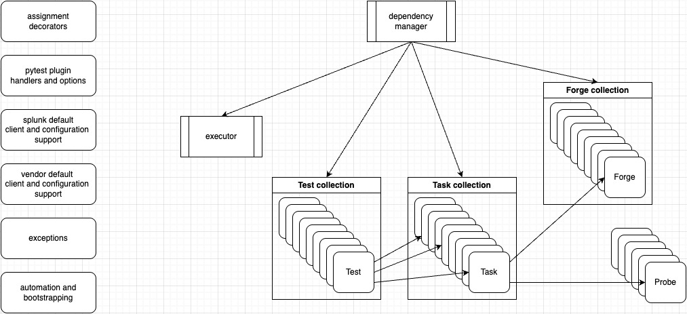
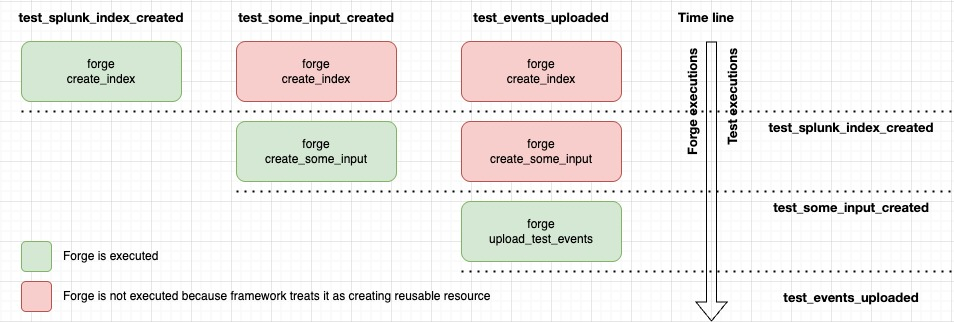
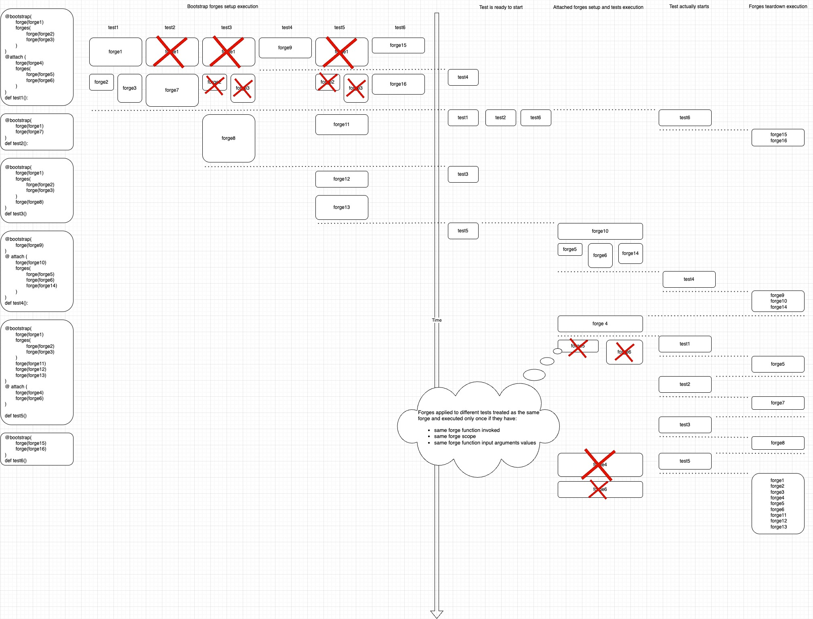

# Framework deep dive
*Not yet finished, writing is still in progress ...*

## Framework philosophy
This section explains the background why this framework was created, what it tries to solve and what ideas it implements

### Popular add-on test scenarios
Spunk technical add-on is an application which goal is to interact with vendor customer environment in order to pull required vendor specific data and then send it to Splunk environment to be ingested and saved in desired Splunk indexes. This makes functional testing of add-ons to stick to a couple of common test scenarios:

1. Test of Add-on configuration validators: 

- interact with add-on API endpoint trying to configure various add-on supported objects (inputs and supporting configuration files) using incorrect values

- expecting that corresponding API endpoint rejects these values with expected explanatory error message in response and proper error logged.

- Delete configuration and objects created for test from Splunk instance.

For example, test can try to configure add-on proxy configuration using unsupported port number and expect that proxy will not be configured and the endpoint responses with an error message clearly pointing to unsupported port number.

2. Data ingestion validation:

- interact with customer environment to apply configurations, create objects or reproduce user actions in order to recreate conditions making desired vendor specific data to appear and ready for pulling to Splunk.

- interact with add-on at Splunk instance to apply configurations and create objects in order engage required add-on modular input to ingest data created for it in customer environment.

- validate ingestion by interacting with Splunk services to makes sure that expected number of events of expected type have been ingested as well as make sure that add-on modular input did not log any error messages during ingestion process.

- Delete configuration and objects created for test from customer environment and Splunk instance.

For example, functional test may verify correct ingestion of data from AWS S3 bucket which may require to configure S3 bucket and upload a data file prepared for test, configure corresponding input the way it would point to correct resource at created S3 bucket, let this input to run and ingest expected data, execute Splunk searches to confirm the number and sourcetypes of ingested events are correct, execute Splunk searches to make sure input did not log any error messages during ingestion process.
### Test requirements
Based on the test scenarios and examples listed above it is clear that for each add-on functional test before actual verification developer should deal with preparing test requirements, i.e. creation of necessary resources at Splunk or vendor related environment - objects and configurations, possibly uploading some test data. Next step is to retrieve some of test environment state properties and only then do the actual checks by comparing retrieved parameters values with expectations. Another thing to take care is to remove prepared resources after the test completion or at the end of test session. There are even more topics to think about connected with test execution optimization: for example, if several test can safely reuse the same resource it would be better to preserve this resource to let it be reused instead of creating and deleting it several times for each tests; or what if several resources for a tests are independent then it would be faster to create them in parallel. Taking care about such improvements makes tests better but at the same time adds complexity and may make them less clear and straightforward and less maintainable. Unified functional test framework was developed with desire make it take care about all the mentioned improvements while hiding from developers all related complexity and giving clear and straightforward way to create test and describe test requirements. 
### Framework requirements
To address the challenges listed above, several core requirements have been developed to be implemented by the framework:

1. Framework should provide a declaration way of describing test requirements (resources required for tests) outside the test function body.

2. Test requirements should be provided in same area as the tests function they belong to and give clear understanding what resources are needed, and in what order they should be created. 

3. Test itself should be as small as possible and only contain as much code as needed for verifications (assert statements) and optionally the code to collect data needed for verifications.

4. Dependencies between resources should be declared as a flat list in contrast to recursive approach where code creating resource also creates all resources it depends on which increases code complexity and hides dependencies from developer potentially making the code difficult to understand and support.

5. Developer should be able to specify if some resources can be created in parallel.

6. Developer should be able to specify what resources can be created in advance and what should be created right before test execution.

7. Framework should understand lifetime of a resource and execute code removing the resource as soon as all tests using it are executed. Developer should have a way to alter default framework behavior for specific tests.

8. Developer should be able to specify conditions for certain resources that can be used by framework to confirm that this resource is created or to wait for this resource to be created during required time.

### Framework basic concepts
To address the above requirements framework introduces a concept of forges - reusable functions responsible for creation and optionally deletion of required resources. They are implemented by developer separately from tests and bound to test functions using 'bootstrap' or 'attach' decorators. The order in which forges are listed within decorators defines the dependencies between forges. In other words, forge declared earlier becomes a prerequisite for a forge declared later. As a result framework will make sure that dependent forge is executed after its dependency. If two or more forges do not depend on each other, they can be declared in the same "line" or block of forges which would tell framework to execute these forges in parallel if possible. 

Forges can accept data via function arguments. The values for those arguments can be defined by a user explicitly or via parametrized arguments when declaring a forge as test requirement. Another way for a forge to receive argument values is to collect them from test artifactory. Artifactory is an internal storage of key-value pairs maintained for each test function separately. The mapping of values from artifactory to forge arguments is done by framework automatically by arguments names. Forges can update artifactory values or create new ones through returned or yielded values. 

When forge function is assigned to a specific tests it will receive argument values specific for this test that may be the same or differ from other test. Depending on argument values the results of forge executions also can be the same or different. In some sense one can think about assigned forge as about a ```task``` that creates a resource or fulfills an action. Framework assumes that forge functions is not affected by any any side values or processes, which means that executing the same forge function with the same argument values should results in the same action taken or in the same resource created. Based on this, same forge executed twice with different argument values is treated by framework as two different ```tasks``` while when executed with the same argument values will be treated as the same ```task``` creating the same resource and by default framework will try to skip unnecessary executions. Internally framework operates with tasks entities that are combinations of a forge function with specific argument values and optionally attached probe and  assigned to a specific test, however developer does not deal with tasks objects directly. 

When assigning a forge to a test, one of two additional properties that developer can configuration is "probe". Probe property allows to attach a probe function that will be used by framework to make sure that action taken by forge indeed has expected result, i.e. a resource has been created or a specific configuration has been applied. Framework will be invoking probe function with certain interval until probe gets successful or time given for probe to success expires. Just like forges probe functions can access test artifactory variables via declared function arguments. Last boolean value returned by a probe will be added by framework to the test artifactory with the name of probe function as the property name so the test function will be able to verify if the probe was successful or exited because of timeout.

Scope is the second of the two arguments that forge can accept when assigned to a tests. Before forge function execution framework pays attention to forge function name, forge function arguments values and forge scope. If there several tests that have the same forge with the same scope assigned to them and those forges have the same call argument values, framework assumes it is the same forge (or forge represents the same task) dedicated to create the same resource and executes it only once. By default all forges have "session" scope which means this comparison will take place across all the executed tests.  Changing scope value at forge assignment to tests allows to narrow the scope of tests for which forge execution results may be reused, for example to all tests in the same module or to a single test. Note that as soon as the last test using forge is executed, framework invokes teardown code of the forge if such code was implemented by developer.

It is also important which of the two decorators are used to assign forge to a test. Bootstrap decorator assumes that forge should create resource before executing tests. All forges assigned to different tests taken as independent and executed in parallel - first go all forges at bootstrap list top, then all in the second place and so on. Attach decorator works differently - it invokes forges right before the test execution. Bootstrap is more preferable way to execute forges to achieve better tests execution times, but it requires from developer more efforts to make sure that forges of different tests do not compete for configuring the same resource. There are some cases where it's possible to avoid this competition, for example when dealing with global or single instance resources like testing different proxy configurations. In those cases it's important to apply each specific configuration right before execution of (i.e. specifically for) related test function and 'attach' decorator is the proper way to do this.

It is important to mention that framework also allows tests to receive (or subscribe for) test artifactory properties generated during forge executions just by using their names to test function argument list. This way forges and probes can prepare some useful values in test artifactory and let test to use them for necessary verifications. 

In some sense forges and pytest fixtures have a lot in common, however they are very different in one important way - the way of organizing dependencies between them. To make a fixture A to depend on results of fixture B, fixture B should be declared as argument of fixture A.  Implemented this way, the relationship between fixture A and fixture B are hardcoded and B cannot be replaced with another fixture that would generate expected output using different source data or algorithm. When fixture A is used in tests, its dependencies are hidden from developer, and to understand what fixture A does, developer should study its dependency B as well, and inside be he may discover other dependencies and so on. In big test projects relationship between fixtures can become pretty sophisticated. Forges dependencies, in contrast, are dynamic and rely on artifactory variables provided by dependency forges, that allows to recombine forges according to desired test scenario and taking into account arguments expected by the forge function and generated by it artifacts. When talking about declaring test dependencies, they all (test dependencies together with forges dependencies) are declared in a form of a flat list located right before test function that gives to developer a clear picture about test requirements, i.e. resources to be created for the test execution.

## Framework structure and entities
Framework is created as pytest plugin and relays on pytest mechanisms of tests execution. Above pytest functionality framework collects information about required forges, tries to execute them optimally respecting defined dependencies and making sure that corresponding tests are not executed before all declared by developer requirements are met.



### Splunk client
Splunk client is a combination of two classes - client class, responsible for interactions with Splunk environment, and configuration class, responsible for providing necessary settings for client class to act and some test data and settings for forge, probe and test functions. This separation is chosen to make it possible to apply different configuration to the same client class and let it communicate with different Splunk instances or point to different test samples and so on. Using provided client and configuration classes framework creates a separate instance of client class for each test and make it available to forge, probe and test functions via internally supported function arguments.

#### Splunk client class
Splunk client class is supposed to implement methods providing access to Splunk and add-on specific API. This client class is what developer deals with through framework supported function argument ```splunk_client``` when implementing framework entities like forges, probes and tests themselves. Developer can use either default client class available out of the box or extend it with add-on API support as well as with custom methods to add support for Splunk related functionality not supported by the framework. Framework tries to save developers' efforts by automating the creation of splunk client class when developer executes framework ```init``` and ```gen``` commands. These commands use openapi.json file generated by UCC while building TA package to create swagger support classes for add-on API endpoints. Then, based on swagger classes, framework generates a new managed client class inherited from framework base client class. At the same time framework generates one more "developer facing" client class inherited from the managed client class. By doing this framework adds support for add-on API and also prepares area for developers' custom code extensions.

#### Splunk functionality supported out of the box.
- *splunk_client.instance_epoch_time()* - returns current time at splunk instance in epoch format

- *splunk_client.search(query)* - executes SPL search query at Splunk instance and returns result in SearchState class object (*splunk_add_on_ucc_modinput_test.common.splunk_instance.SearchState*)

- *splunk_client.create_index(name)* - creates Splunk index with a given name and returns *splunklib.Index* object.

- *splunk_client.default_index()* - returns default Splunk index name if framework configured to create one.

- *splunk_client.search_probe(probe_spl, verify_fn, timeout, interval, probe_name)* - probe generator function to simplify creation of framework probes based on Splunk searches.

- *splunk_client.repeat_search_until(spl, condition_fn, timeout, interval)* - methods execution Splunk search continuously in defined intervals until it gets expected result or reaches timeout.

- *splunk_client.instance_file_helper()* - Factory method for SplunkInstanceFileHelper, allowing to execute some file operations directly on Splunk host. Requires ```Splunk Add-on for Modinput Test``` to be installed on the Splunk host. May be used for creation and verification of file based checkpoints. 

- *splunk_client.app_file_helper()* - same as instance_file_helper except SplunkInstanceFileHelper (*splunk_add_on_ucc_modinput_test.functional.common.splunk_instance_file*) will treat provided file paths as relative to add-on root folder on Splunk host. Requires ```app_name``` property to be part of ```splunk_client``` configuration class,

#### Add-on API endpoint support
Each technical add-on creates an additional set of API endpoints responsible for add-on resources like inputs, configuration files and custom rest handlers. 
As mentioned earlier framework ```init``` and ```gen``` commands 

#### Client configuration class
Client configuration class is a separate class dedicated to collect all settings for client class. Framework contains implementation of the base configuration class to collect settings for base client class functionality. Developer has an option to extend it by inheriting a new class form base configuration class and adding new properties as well as redefine values or sources of default properties. Framework ```init``` command generates default client configuration class that looks like the following
```python
from splunk_add_on_ucc_modinput_test.functional.splunk import (
    SplunkConfigurationBase,
)
class Configuration(SplunkConfigurationBase):
    def customize_configuration(self) -> None:
        # to be implemented
        # self.encoded_prop = utils.get_from_environment_variable(
        #     "ENV_PROP_NAME1", string_function=utils.Base64.decode
        # )
        # self.not_encoded_prop = utils.get_from_environment_variable(
        #     "ENV_PROP_NAME2"
        # )
        pass
```
As seen from the example, developer has to overwrite ```customize_configuration``` method to add additional configuration properties. This method is called from class \_\_init\_\_ method and added to simplify defining of new configuration properties by avoiding overwriting  \_\_init\_\_ method itself that requires some specific arguments expected by framework. 

Collection of default framework properties is implemented through class methods listed below. If there is a need to alter values, sources or collection algorithms for some of these properties, corresponding methods should be overwritten.

- ```collect_host(cls) -> str | None``` - to collect Splunk host name. Default value source is environment variable MODINPUT_TEST_SPLUNK_HOST.

- ```collect_port(cls) -> str | None``` - to collect Splunk host port. Default value source is environment variable MODINPUT_TEST_SPLUNK_PORT.

- ```collect_username(cls) -> str | None``` - to collect Splunk user name. Default value source is environment variable MODINPUT_TEST_SPLUNK_USERNAME.

- ```collect_password(cls) -> str | None``` - to collect Splunk user password. Default value source is environment variable MODINPUT_TEST_SPLUNK_PASSWORD_BASE64.

- ```collect_splunk_dedicated_index(cls) -> str | None``` - to collect name of existing Splunk index. Default value source is environment variable MODINPUT_TEST_SPLUNK_DEDICATED_INDEX.

- ```collect_splunk_token(cls, is_optional: bool) -> str | None``` - to collect Splunk token. Default value source is environment variable MODINPUT_TEST_SPLUNK_TOKEN_BASE64.

- ```collect_acs_server(cls, is_optional: bool) -> str | None``` - to collect Splunk ACS service url. Default value source is environment variable MODINPUT_TEST_ACS_SERVER.

- ```collect_acs_stack(cls, is_optional: bool) -> str | None``` - to collect Splunk CS stack. Default value source is environment variable MODINPUT_TEST_ACS_STACK.

Note that ```is_optional``` is boolean argument tells method if property is treated as optional or mandatory. If property is mandatory and method fails to collect value it should log a critical error and raise SplunkClientConfigurationException exception (*splunk_add_on_ucc_modinput_test.common.utils*). 
```python
class Configuration(SplunkConfigurationBase):
    ...
    @classmethod
    def collect_host(cls) -> str | None:
        return <your code to provide the value>

    @classmethod
    def collect_acs_server(cls, is_optional: bool) -> str | None:
        try:
            return <your code to provide the value>
        except Exception:
            if is_optional:
                return None
            else:
                logger.critical("Your error message")
                raise SplunkClientConfigurationException()
```
Beside default framework properties, configuration class gives access to command argument values defined for pytest executions via properties: ```probe_invoke_interval```, ```probe_wait_timeout```, ```do_not_fail_with_teardown``` and so on. It's easy to guess any property name for any argument by removing from argument name leading dashes and replacing internal dashes with underscores, for example ```--bootstrap-wait-timeout``` argument name turns to ```bootstrap_wait_timeout``` property name.

### Splunk Client and configuration classes binding decorators
When custom Splunk client and configuration classes are implemented there is one more step to be done to let framework know about these classes and use them. This can be done by using one of the decorators: ```register_splunk_class``` or ```define_splunk_client_argument```. 

#### register_splunk_class(swagger_client, splunk_configuration_class)
This decorator should be applied to the Splunk client class created by a developer. It takes imported swagger client module as the first argument and binds it to client. Second argument is Splunk client configuration class implemented by developer. Decorator registers it in framework together with the Splunk client class. Usage of this decorator may look as the following
```python
import swagger_client

class Configuration(SplunkConfigurationBase):
    # your configuration class implementation

@register_splunk_class(swagger_client, Configuration)
class SplunkClient(ManagedSplunkClient):
    # code extending base Splunk client class
```
Having both classes registered, framework is capable to create instances of Splunk client classes with configuration class assigned to the instance and make it available via splunk_client builtin function argument in forges, probes and tests. 
```python
def my_forge(splunk_client: SplunkClient):
    splunk_client.some_splunk_client_method() # some splunk client class method (exact name depends on the class implementation)
```

The idea behind implementing client and configuration classes separately is to make it possible to use Splunk client class with different configurations. This may be useful to give tests access to several Splunk instances, for example, to execute comparative verifications of different Splunk and/or add-on versions. For this framework has another decorator that allows to register Splunk client class multiply times with different configuration classes.

#### define_splunk_client_argument(swagger_client, splunk_client_class, splunk_class_argument_name)
In contrast to ```register_splunk_class```, this decorator must be applied to a configuration class. It takes imported swagger client module as the first argument and binds it to client class specified in the second decorator argument. Last decorator argument is optional and allows to define new builtin framework argument name for the pair of client and configuration classes. By default this argument has value 'splunk_client' so leaving it unspecified allows to overwrite binding to default builtin argument - when used this way both decorators work identically. However, defining different value will create a new builtin variable for specified combination of splunk client and configuration classes. Note that ```splunk_class_argument_name``` value when specified should comply with python rules of variable naming.
```python
import swagger_client

class SplunkClient(ManagedSplunkClient):
    # code extending base Splunk client class

@splunk_class_argument_name(swagger_client, SplunkClient)
class ConfigurationSplunk9(SplunkConfigurationBase):
    def customize_configuration(self) -> None:
        # define configuration to access Splunk v9 instance

@splunk_class_argument_name(swagger_client, SplunkClient, "splunk_client_v10")
class ConfigurationSplunk10(SplunkConfigurationBase):
    def customize_configuration(self) -> None:
        # define configuration to access Splunk v10 instance
```
In the example above ```ConfigurationSplunk9``` is registered without ```splunk_class_argument_name``` value specified, which means that framework will attach it and the client class to default ```splunk_client``` variable. For configuration class ```ConfigurationSplunk10``` ```splunk_class_argument_name``` is defined as *"splunk_client_v10"* which adds to framework new builtin variable *splunk_client_v10* and through it framework will make available a Splunk client class object created using ```ConfigurationSplunk10``` configuration. This way forges, probes and tests will be able to use both builtin variables if needed:
```python
def my_forge1(splunk_client: SplunkClient, splunk_client_v10: SplunkClient):
    splunk_client.some_splunk_client_method() # action at Splunk v9 instance
    splunk_client_v10.some_splunk_client_method() # same action at Splunk v10 instance

def my_forge2(splunk_client_v10: SplunkClient):
    splunk_client_v10.some_other_splunk_client_method() # another action at Splunk v10 instance
```

Note that if all client classes are registered with (bound to) custom internal variable names, internal variable 'splunk_client' will still be available and bound to default client and configuration classes with default methods and configuration properties defined.

### Vendor client
Vendor client is a combination of two classes - client class, responsible for interactions with vendor environment, and configuration class, responsible for providing necessary settings for client class to act and some test data and settings for forge, probe and test functions. This separation is chosen to make it possible to apply different configuration to the same client class and let it communicate with different vendor hosts or point to different test samples and so on. Using provided client and configuration classes framework creates a separate instance of client class for each test and make it available to forges, probes and tests via internally supported function arguments.

#### Vendor client class
Vendor client class should be created by developer to access vendor related environments like vendor cloud services, appliances or even user desktop monitored by vendor tools in order to trigger desired events. Similar to Splunk client class, this client class is what developer deals with through framework supported function argument ```vendor_client``` when implementing framework entities like forges, probes and tests themselves. Framework creates one instance of this class object per test. Having no knowledge about possible vendor environments framework has very little out of the box support for vendor class: base classes for vendor client and configuration. The approach remains similar to the one used for Splunk classes - both custom vendor client and configuration classes must be implemented from base classes offered by framework and then registered in the framework using ```register_vendor_class``` or ```define_vendor_client_argument``` decorators.

#### Configuration class
Similar to Splunk client configuration, Vendor client configuration class should be created to provide client class with required configuration. Framework binds client and configuration classes at runtime when creates client instances - one for each tests. Framework implements default vendor configuration class that provides access to the same set of command prompt arguments values specified for pytest execution. The only place to setup configuration properties is  ```customize_configuration``` method.  In contrast to Splunk client configuration class, it does not have any default vendor configuration properties, so there are no corresponding collection methods to overwrite. 
```python
from splunk_add_on_ucc_modinput_test.functional.vendor import (
    VendorConfigurationBase,
)
class Configuration(VendorConfigurationBase):
    def customize_configuration(self) -> None:
        # to be implemented
        # self.encoded_prop = utils.get_from_environment_variable(
        #     "ENV_PROP_NAME1", string_function=utils.Base64.decode
        # )
        # self.not_encoded_prop = utils.get_from_environment_variable(
        #     "ENV_PROP_NAME2"
        # )
        pass
```

### Client classes register decorators
When custom vendor client and configuration classes are implemented there is one more step to be done to let framework know about these classes and use them. Similar to Splunk classes, this can be done by using one of the decorators: ```register_vendor_class``` or ```define_vendor_client_argument```. They act the same way as Splunk client binding decorators except they do not require swagger module to be specified. 
```python
class Configuration(VendorConfigurationBase):
    # your configuration class implementation

@register_vendor_class(Configuration)
class VendorClient(VendorClientBase):
    # code extending base vendor client class
```
If tests suppose to communicate with different vendor appliances based on different API, framework supports having several different vendor classes bound to different configurations and assigned to different framework internal variable names. Scenario with same class bound to different configurations is also supported.
```python
class CiscoMeraki(VendorClientBase):
    # code extending base vendor client class

class CiscoWSA(VendorClientBase):
    # code extending base vendor client class

@vendor_class_argument_name(CiscoMeraki)
class Meraki132Configuration(VendorConfigurationBase, "meraki132_client"):
    def customize_configuration(self) -> None:
        # define configuration to access Cisco Meraki v1.32.0 appliance

@vendor_class_argument_name(CiscoMeraki)
class Meraki138Configuration(VendorConfigurationBase, "meraki138_client"):
    def customize_configuration(self) -> None:
        # define configuration to access Cisco Meraki v1.38.0 appliance

@vendor_class_argument_name(CiscoWSA, "wsa_client")
class WSAConfiguration(VendorConfigurationBase):
    def customize_configuration(self) -> None:
        # define configuration to access Cisco WSA appliance
```
In the examples above ```register_vendor_class```binds ```Configuration``` class to ```VendorClient``` class and makes client instances created by this pair available through ```vendor_client``` variable. Another example demonstrates ```vendor_class_argument_name``` decorator binding same client class ```CiscoMeraki``` to two different configurations classes```Meraki132Configuration``` and ```Meraki138Configuration``` that become available via ```meraki132_client``` and ```meraki138_client``` internal variables. As well as another binding of vendor client class ```CiscoWSA``` to it's own configuration class ```WSAConfiguration``` thad becomes available via ```wsa_client``` internal variable. This way forges, probes and tests will be able to use all four  builtin variables if needed:
```python
def my_forge1(meraki132_client: CiscoMeraki, meraki132_client: CiscoMeraki):
    meraki132_client.some_meraki_client_method() # action at Meraki appliance with v1.32.0
    meraki138_client.some_meraki_client_method() # same action at Meraki appliance with v1.32.0

def my_forge2(wsa_client: CiscoWSA):
    wsa_client.some_ciscowsa_client_method() # another action at Cisco WSA appliance
```
Note that iff all client classes registered with (bound to) custom internal variable name, internal variable 'vendor_client' will still be available and bound to default client and configuration classes with nor methods of configuration properties defined.

### Forges
As said earlier, forges are reusable functions responsible for creation and optionally deletion of resources required by tests. Like pytest fixtures forges can receive and return values and can be implemented as regular or generator function functions. If implemented as a generator function, the first yield will be separating setup and teardown code of the forge. In the following sections these topics explained in more details:

#### Forge function arguments
Forge function can receive any number of arguments. Before forge is executed, framework analyses argument names and tries to collect and provide values for forge execution by mapping its function argument names to different internal dictionaries like test artifactory, built in arguments created by framework and arguments explicitly specified by user at forge assignment stage.

##### Builtin arguments (reserved argument names)
Framework supports the following out of the box builtin properties that can be mapped by name to forge, probe and test function arguments:

- **splunk_client** - is an instance of splunk client class created by developer separately and registered in framework using corresponding decorator. Framework creates dedicated Splunk client class instance per test, initializing it using configuration class responsible for collecting necessary setting from different sources like environment variables, hardcoded values. There is a way to tell framework to create additional splunk client instance with different configuration that would be mapped it to desired function argument names, for example ```splunk_v10_client```. This may be useful when running tests at two or more splunk instances at the same time, for example, for Splunk or add-on upgrade tests. 

- **vendor_client** - similarly to splunk client class this one is an instance of vendor client class created by developer separately and registered in framework using corresponding decorator. Framework creates dedicated vendor client class instance per test, initializing it using configuration class responsible for collecting necessary setting from different sources like environment variables, hardcoded values. There is a way to tell framework to create additional vendor client instances with different configurations that would be mapped it to a desired function arguments names, for example vendor_client_appliance2.  This may be useful when running tests at two or more vendor instances at the same time, for example, when testing with two different vendor appliances or using instances running different versions of vendor software.

- **session_id** - is a unique identifier generated by framework for each test execution. It may be helpful to name reused resources to make sure that from test execution to execution those resources have unique names

- **test_id** - is a unique identifier generated by framework for each test during tests execution. It may be helpful to name resources dedicated to specific tests to avoid conflicts between different tests that other way may by chance get their resources named identically.

#### Forges as regular functions
Below is example of a forge implemented as a regular function
```python
def my_forge(splunk_client: SplunkClient, test_id: str, other_argument: str):
    input_name = f"my_input_{test_id}"
    splunk_client.create_some_input(input_name, other_argument) # some splunk client class method to create an input (exact name depends on the add-on)
    return input_name
```
When execution above forge for specific test framework will first collect all necessary forge arguments, i.e. splunk_client and test_id will be taken from builtin arguments, other_argument will be mapped either from test artifactory, explicitly defined arguments or from parametrized arguments. Next framework will execute forge with prepared arguments passing them to forge function as keyword arguments. When forge is executed framework gets its return value. If return value is not None framework will create new new key-value pair (artefact) in test artifacts with the name of forge function as key and returned value as a value. 

There is a way to let forge to control the name of created artifact as well as to tell framework to save several artifacts. For this instead of returning a single value forge can return a dictionary object with desired artifact names mapped to desired returning values. For example
```python
def my_forge(splunk_client: SplunkClient, test_id: str, other_argument: str):
    input_name = f"my_input_{test_id}"
    successful = splunk_client.create_some_input(input_name, other_argument)  # some splunk client class method to create an input
    return dict(  # it's recommended to use dict() constructor to makes sure that artifact name used is a valid python variable.
        input_name = input_name,
        successful = successful
    )
```
Above forge function returns dictionary telling framework to update artifactory with 'input_name' and 'successful' artifacts with corresponding values. Note, that if artifacts with the same names already exist the will be overwritten.
#### Forges as generators functions
Forges as generators are useful when resources created by forge need to be removed and forge should contain teardown code to fullfil deletion. In that case yield statement of generator function splits setup and teardown code like in the following example:
```python
def my_forge(splunk_client: SplunkClient, test_id: str, other_argument: str):
    input_name = f"my_input_{test_id}"
    successful = splunk_client.create_some_input(input_name, other_argument) # some splunk client class method to create an input
    yield dict(  # it's recommended to use dict() constructor to makes sure that artifact name used is a valid python variable.
        input_name = input_name,
        successful = successful
    )
    # teardown code starts here
    if successful:
        splunk_client.delete_some_input(input_name)
```
As seen from the example, now instead of returning values to be stored in artifactory they should be yielded. It is fine to use yield without any value - this will mean that forge does not intend to update or create any artifacts in test artifactory. Note that as soon as forge invokes yield operator function return value will be ignored ignored. However if forge function has yield statement but does not yield, framework will again rely on returned forge value. This allows framework to support scenarios with conditional teardown. In other words, when forge needs teardown code to be executed it yields, and if teardown is not needed it returns.
```python
def my_forge(splunk_client: SplunkClient, test_id: str, does_not_need_teardown: bool = False):
    input_name = f"my_input_{test_id}"
    successful = splunk_client.create_some_input(input_name, other_argument) # some splunk client class method to create an input
    artifacts = dict(  # it's recommended to use dict() constructor to makes sure that artifact name used is a valid python variable.
        input_name = input_name,
        successful = successful
    )
    if does_not_need_teardown:
        return artifacts
    
    yield artifacts:
    
    # teardown code starts here
    if successful:
        splunk_client.delete_some_input(input_name)
```
In above example forge skips (turns off) teardown block by using ```return``` statement when function argument ```does_not_need_teardown``` value is True.

### Artifactory
Artifactory is an internal storage of key-value pairs maintained for each test function separately. It stores variables added by framework based on analysis of values provided by forges and probes. Test artifactories maintained by the framework automatically based on results collected from forges and probes. As well framework handles mapping of artifacts to forge, probe and test function arguments. This means that as soon as a new key value pair is added to test artifactory it can be used by forge, probe and test functions just by declaring function arguments using names of stored artifacts. For example, let's have a forge that creates an S3 bucket at AWS environment and returns ```bucket_name``` artefact
```python
def create_s3_bucket(vendor_client: VendorClient, test_id: str, bucket_config: Dict[str, object]):
    bucket_name = f"my_s3_bucket_{test_id}"
    vendor_client.create_s3_bucket(bucket_name, bucket_config) # some vendor client class method to create an s3 bucket
    return dict(bucket_name=bucket_name)
```
Now we can create another forge that would upload files with required data samples to created s3 bucket and returns another artifact - ```successfully_uploaded```:
```python
def upload_s3_bucket_files(vendor_client: VendorClient, bucket_name: str, data_file_path: str):
    bucket_name = f"my_s3_bucket_{test_id}"
    success = vendor_client.upload_file_to_s3_bucket(bucket_name, data_file_path) # some vendor client class method to upload files to s3 bucket
    return dict(successfully_uploaded=success)
```
And finally we implement a test function that depends on the above two forges:
```python
@bootstrap(
    forge(create_s3_bucket, bucket_config={"some": "config"}),
    forge(upload_s3_bucket_files, data_file_path="some/file/path")
)
test_s3_bucket(vendor_client: VendorClient, bucket_name: str, successfully_uploaded: bool):
    assert list_of_bucket_resources is True
    list_of_bucket_resources = vendor_client.list_bucket_files(bucket_name)
    assert expected_resource_name in list_of_bucket_resources
```
Above demonstrates how ```bucket_name``` and ```successfully_uploaded``` artifacts returned by forges can be used in arguments of other forges and in test function arguments.
```bootstrap``` decorator and other control elements required to declare test dependencies are explained in next section. Note where values for other forge arguments are taken from:
- ```vendor_client``` and ```test_id``` are builtin arguments provided by the framework. 
- ```bucket_config``` and ```data_file_path``` are defined explicitly by developer at test requirements declaration section.

## Forge assignment ```scope```
Forge assignment ```scope``` is a name of a common name or a marker grouping several forge assignments to tests. There are no special structures behind such group, only the name. Using the same group name with several forge assignments makes the resource belong to the scope of this group of tests. If to think about forge as about a declaration of test requirement to create a resource, the scope will define a group of tests sharing this resource. Forge ```scope``` is an important term in framework that allows to leverage forge setup and teardown parts executions by the framework. Scope is a part of the framework internal mechanism that allows multiply tests to have common dependency, i.e. to reuse resources created by same forge function and avoid unnecessary creations and deletions of this resource multiple times for each test. This mechanism is based on the following logic:

1. When framework plans execution of a forge function attached to a tests, it looks through internal records to check if this forge function has been already executed in context of a different test. 

2. Framework assumes that forge functions is not vulnerable to any side effect. In other words, if to execute the same forge function with the same argument values, it will do the same action or it will generate the same resource. So if framework finds previous execution of the forge with the same argument values, it's about to treat it as requirement for the same resource. 

3. If forge argument values are the same framework supposes that it's going to create the same resource and almost ready to make a decision to skip forge execution.

4. The last step before making the final decision about skipping the forge execution is to make sure if this is what developer wants to be done. At this point forge scopes are taken into account. Framework checks the forge declarations at both tests - where the forge function was executed and the current tests. If they have the same scope specified then forge execution is skipped. 

Knowing the above logic developer can tell framework how to treat the forge by letting forges to stay in the same scope or split them ito different scopes. Developer can use any string as a scope name, however there are three names that have special meaning for the framework:

- ```session``` - This is default scope name, which means that every forge assigned to every test has this scope if nothing different is specified. So by default all forge assignments belong to the same group for all tests, no matter in which module test is implemented. That in it's turn means that for all tests the same forge function with the same argument values will be treated by framework as creating the same resource and and will be executed only once. 

- ```module``` - This scope name says that forge assignment scope should be limited to all tests of the same test module (python source file). When framework registers forge assignment to a tests it does not store scope name as is, instead it replaces ```module``` with the path of the test module where this assignment takes place. Note that forge assignments with ```session``` scope and ```module``` scope remain in different scopes even if they are located in the same test module, i.e. ```module``` scope is made only of forge assignments with scope ```module``` and located in the same test module. In some sense value ```module``` is a shortcut to tests module file path, so using it in several test modules in reality creates a separate scope for each of those test modules.

- ```function``` - This scope name says framework to consider forge (or resource created by it) only in context of one single tests that this forge is assigned to. This means that framework will never treat this forge as creating common reusable resource. Similar to ```module``` scope, ```function``` scope name is not saved as is, instead framework replaces ```function``` string with full path to the test function that includes the path to test function module source file, test function class if exists and test function name.

Knowing the forge scope (single test or a group of tests), framework can estimate the lifetime of the resource created by forge function. It monitors the moment when the last test using this resource completes and immediately invokes forge teardown part to remove the resource. 

To early catch typos in predefined scope names framework defines enum object with corresponding enum values in ```splunk_add_on_ucc_modinput_test.functional.constants``` module:
```python
class ForgeScope(Enum):
    FUNCTION = "function"
    MODULE = "module"
    SESSION = "session"
```
To summarize:

- Forge assignment scope is about altering default framework behavior when a forge function assigned to multiply test functions.

- In most cases there is no need to alter default behavior, as framework can clearly understand when a forge assigned to several tests is going to create the same resource or different one judging only by forge argument values. 

- Explicit scope assignment makes sense only when developer has something specific in mind that does not much default framework behavior and wants to tell framework to create resource for specific test or group of tests where otherwise it would reuse existing resource. 

- Same results can be achieved by manipulation of forge argument values, however some scenarios are more difficult to implement. Easiest scenario is to tell framework that specific forge creates separate resource for each test. It can be done by using builtin forge argument ```test_id``` - it will make forge argument values different from test to tests and at the same time provides unique identifier to form a unique name for created resource.

- When adjusting framework logic by explicitly defining forge assignment scope it is recommended to review names and lifetimes of the resources created by the forge to avoid failures caused by attempting to create resources with the same name as existing ones.

## Forge assignment
For forge assignment to tests framework implements two test function decorators that create binding between forges and a test and at the same time define when forge should be invoked - before all tests execution starts or before exact test execution starts. There are also two data collection helper classes tat allow to arrange forge dependencies and apply additional builtin and custom settings like scope and probe assignment, as well as explicit/in-place forge arguments values definition. Note that the same forge function can be assigned to different test functions, however framework does not support assigning same forge function to the same test function multiply times. Order of forges in which they are listed within used decorator defines forges dependencies, which means that each preceding forge (i.e. resource it creates) becomes a requirement for the forge following it. Note that each test should declare all forges (resources) it depends on, so if too tests depend on same resources they both should have the same list of forges declared in the same order.

### Helper data collection classes
These helper classes together allow developer to specify all forge data necessary to create internal forge object, as well as to define which forges can be executed in parallel and which sequentially.

#### ```forge``` helper data collection class
Let's start with this helper data class ```forge``` as it allows to specify all forge data necessary to create internal forge object. It was already used in some example of previous sections. It has only one mandatory positional argument that receives forge function itself. There are two other arguments that have special meaning for the framework - ```probe``` and ```scope```. They are optional and if used must be specified as named arguments. The first named argument, ```probe```, allows to link a probe function to the forge function assignment and by default takes value ```None```, which means no probe function is assigned.  The second named argument, ```scope```, defines forge assignment scope. By default scope value for all forge assignments is "session" if not redefined by ```forges``` helper data class. ```forge``` class constructor also allows to define argument values for assigned forge. Note that explicitly defines=d value for forge argument will have precedence over artifactory value is such exists in test artifactory. Here is an example of a forge function and this forge assignment using ```forge``` helper data class.
```python
from splunk_add_on_ucc_modinput_test.functional.constants import ForgeScope
def create_splunk_index(splunk_client, index_name):
    splunk_client.create_index(index_name)

@bootstrap(
    forge(create_splunk_index, index_name="some_index", scope=ForgeScope.FUNCTION, probe=wait_for_index_creation)
)
test_something(splunk_client)
    # test implementation
```
In above example forge ```create_splunk_index``` is assigned to test function ```test_something```. Beside forge function, ```forge``` helper data class constructor defines forge assignment (resource) scope as ```function``` and assigns ```wait_for_index_creation``` function as probe. Additionally it defines ```index_name``` argument value for the forge function, so when ```create_splunk_index``` function will be invoked it will receive ```splunk_client``` object from framework builtin argument and ```index_name``` value from this explicit value assignment.  

Within ```bootstrap``` or ```attach``` assignment decorators can declare multiply forge assignments one after another. This ordered list defines the sequence of forge function execution and can be treated as forge dependencies on each other. In other words, forge A preceding forge B in this least can be taken as forge A is a pre-requirement for forge B and must be executed before forge B. For example, Splunk index should be created before add-on modular input using this index, so forge creating index should be listed before the forge creating the modular input:
```python
def create_splunk_index(splunk_client, index_name):
    splunk_client.create_index(index_name)

def create_splunk_input(splunk_client, input_name):
    splunk_client.create_input(input_name)

@bootstrap(
    forge(create_splunk_index)
    forge(create_splunk_input)
)
test_something(splunk_client)
    # test implementation
```
#### ```forges``` helper data collection class
This is a helper data class that allows to define at certain position of forge assignment list a sub-list of independent forges that can be executed by framework in parallel. In other words, it allows to put a set of forges in place of a single forge assignment. 

This data collection class constructor receives unlimited number of ```forge``` data collection object and one optional named argument ```scope``` that allows to define scope for the whole group of listed forges.

This helper data collection class can be very useful if the resources to be created do not dependent on each other and though there is no reason to create them one after another. Much faster to create them in parallel.  For example, two types of modular inputs can be created independently but both depend on creation of an index they are going to use:
```python
def create_splunk_index(splunk_client, index_name):
    splunk_client.create_index(index_name)

def create_input_of_type_A(splunk_client, input_name):
    splunk_client.create_input_a(input_name)

 def create_input_of_type_B(splunk_client, input_name):
    splunk_client.create_input_b(input_name)

@bootstrap(
    forge(create_splunk_index)
    forges(
        forge(create_input_of_type_A),
        forge(create_input_of_type_B),
        scope=ForgeScope.MODULE
    )
)
test_something(splunk_client)
    # test implementation
```
Note that in the example ```scope``` value is defined in ```forges``` and it changes default scope for every forge in its internal list. 

### Forge assignment decorators
```bootstrap``` and ```attach``` decorators take a mixed list of ```forge``` and ```forges``` instancies and do the actual assignment of each forge function to specific test function taking into account dependency information and the settings collected by the data classes. Depending on which decorator was used, assigned forges will have different execution algorithm and schedule.

#### ```bootstrap``` decorator
In accordance to decorator name it allows to assign forges that should be executed before tests started. There are several rules that framework follows:

- Framework executes sequences of bootstrap forges for all tests at the same time. It means that framework will pick first bootstrap forge from each test and execute them all in parallel, then it will go to the next bootstrap forge of each test and again executes them in parallel until there is no bootstrap forges to execute

- Tests themselves executed sequentially by pytest. Before letting test go framework makes sure that bootstrap forges for this tests are successfully executed.

- To minimize test waiting for bootstrap forges, framework reorders test functions depending on how many bootstrap forges it has assigned - tests with less bootstrap forges go to the beginning of the test execution list. This way tests with less dependencies will be executed before not waiting for all bootstrap forges to be executed. *Note that this internal optimization will not work for tests that besides bootstrap also have forges assigned with ```attach``` decorator*.

Let's take a look at the example below that has two tests with five different forges assigned - tree forges assigned to one test and two others to the other test:
```python
@bootstrap(
    forge(forge_function1)
    forge(forge_function2)
    forge(forge_function3)
)
test_something()
    # test implementation

@bootstrap(
    forge(forge_function4)
    forge(forge_function5)
)
test_something_else()
    # test implementation    
```
Here are the steps that framework will take to process these tests:

1. Based on forge assignment information framework will build forge execution matrix like below:
    ```
    step 1: forge_function1, forge_function4
    step 2: forge_function2, forge_function5
    step 3: forge_function3
    ```

2. Framework will reorder test functions sequence:
    ```
    1. test_something_else
    2. test_something
    ```

3. Framework deploys execution of forges. Each step will be executed sequentially, however forge functions in each step will be executed simultaneously using multithreading. By default framework is configured to use 10 threads, which can be adjusted via pytest command option ```--number-of-threads```. 

4. Framework finishes setup phase and let pytest to execute tests. According to updated test sequence, test ```test_something_else``` will be first for execution.

5. Here framework checks ```test_something_else``` test requirements and keep it waiting until forge ```forge_function5``` is executed which happens somewhere in the middle of step 2. As soon as forge ```forge_function5``` is executed, test  ```test_something_else``` is unblocked and pytest executes it as well.

6. After ```test_something_else``` test function gets executed, framework will verify if forges assigned to the test will be needed to other tets. In this example forges ```forge_function4``` and ```forge_function5``` used only with ```test_something_else``` tests so framework will try to execute teardown part of each forge if such exist.

7. pytests jumps to test ```test_something``` where framework blocks it again until forges deploying it's requirements executed. This time it happens with ```forge_function3``` forge execution and actually with completion of the whole bootstrap process. In these forges teardown part is missing.

8. As soon as ```forge_function3``` is executed, framework lets pytest to execute ```test_something``` test function.

9. After execution of ```test_something``` test, framework will verify if forges assigned to the test will be needed to other tets. Again, in this example forges ```forge_function1```,```forge_function2```  and ```forge_function3``` used only with ```test_something``` tests so framework will try to execute teardown part of each forge if such exist. In these forges teardown part is also missing.

Let's take a look at another test scenario using bootstrap decorator and reusable forges/resources:
```python
def create_splunk_index(splunk_client):
    # code to create index

def create_some_input(splunk_client):
    # code to create input

def upload_test_events(vendor_client):
    # code to upload events

@bootstrap(
    forge(create_splunk_index)
)
test_splunk_index_created(splunk_client, index_name)
    assert splunk_client.get_index(index_name) is not None

@bootstrap(
    forge(create_splunk_index),
    forge(create_some_input)
)
test_some_input_created(splunk_client, input_name)
    assert splunk_client.get_some_input(input_name) is not None

@bootstrap(
    forge(create_splunk_index),
    forge(create_some_input),
    forge(upload_test_events)
)
test_events_uploaded(vendor_client)
    assert vendor_client.count_uploaded_events() == 123

```
Flowchart for this example test scenario will look as the following:


As mentioned earlier framework analyzes names, scopes and argument values of assigned forges to decide if same forge used by several tests actually creates the same resource that those tests intend to reuse. In the above tests all reused forges are treated as creating reused resource because they use same default scope, they do not use arguments except splunk and vendor clients (clients are not counted at argument value comparison). Fore reusable resources setup and teardown sections executed once for all tests using this resource - setup part is executed before the first tests using the forge and teardown after the last test using the forge. In this example setup for ```create_index``` forge executed before ```test_splunk_index_created``` and teardown part of this forge is executed after ```test_events_uploaded```.

#### ```attach``` decorator
This decorator defines a sequence of forges to be executed right before the tests execution they assigned to. Just like ```bootstrap``` decorator, ```attach``` decorator accepts a mixed list of ```forge``` and ```forges``` instances and executes each list item sequentially, while items inside each ```forges``` instance are executed all together. Let's take a look at the example below with two test function and five forges assigned to them using ``attach`` decorator.
```python
@attach(
    forge(forge_function1)
    forges(
        forge(forge_function2), 
        forge(forge_function3),
    )
)
test_something()
    # test implementation

@attach(
    forge(forge_function4)
    forge(forge_function5)
)
test_something_else()
    # test implementation    
```
Here are the steps that framework will take to process these tests:

1. As there are not bootstrap forges used framework will skip bootstrap planning and execution steps. Execution order will not be changed because of the same reason. So framework will pass control over to pytest to start execution of tests functions. 

2. As the test execution order is not changed, pytest starts from ```test_something``` test function. First framework will verify that there are not bootstrap dependencies for this tests, so there is nothing to wait from this part. 

3. Next framework will check if there are forges assigned using ```attach``` decorator (in-place forges). For ```test_something``` test function there are three in-place forges assigned - ```forge_function1``` forge that is a dependency for other to forges ```forge_function2``` and ```forge_function3```. For them framework will build forge execution matrix like below:
    ```
    step 1: forge_function1
    step 2: forge_function2, forge_function3
    ```
4. Before framework deploys the forge execution matrix it will wait for bootstrap process to finish, no matter whether there are bootstrap dependencies for this tests or not. In the example there are no bootstrap process and there is nothing to wait for.

4. Framework will deploy the matrix. Like with bootstrap forge execution matrix, each step will be executed sequentially, while forge functions in each step will be executed simultaneously using multithreading. Until the last forge function of execution matrix gets executed, ```test_something``` test function remains blocked by framework.

5. Framework unblocks test and let it be executed by pytest engine.

6. After execution of ```test_something``` test, framework will verify if forges assigned to the test will be needed to other tets. Again, in this example forges ```forge_function1```,```forge_function2```  and ```forge_function3``` used only with ```test_something``` tests so framework will try to execute teardown part of each forge if such exist. In these forges teardown part is also missing.

7. Now framework lets pytest to switch to the next test which in our example is ```test_something_else```.

8. Again framework prepares forge execution matrix for the test
    ```
    step 1: forge_function4
    step 2: forge_function5
    ```

9. ... verifies if the test should wait for its bootstrap dependencies and bootstrap precess as a whole, runs forges execution matrix.

10. When all forges are executed framework let's pytest to run the test.

11. After test execution, framework invokes teardown sections of the forges no longer required by other tests. In above example ```test_something_else``` is the last tests so no resources a needed anymore so framework will try to invoke teardown for remaining forges - ```forge_function4``` and ```forge_function5```. However those forges do not have teardown sections so at the end no cleanup code will be invoked.

####  When using ```bootstrap``` and ```attach``` decorators together with the same test
Tests can have forges assigned using both decorators at the same time. In general execution flow for tests having both types of forges will look a combination of the two previous tests:

1. Framework executes test bootstrap forges in together with other tests bootstrap forges

2. Test waits for it's turn according to pytest item list

3. Framework executes test attached forges

4. pytest executes the test itself

5. Framework executes teardown sections of no longer needed resources

As seen from previous sections, attached forges always executed after bootstrap process is fully complete. In practice it means that test sorting done by framework for optimization purposed will not move tests with attached forges to the beginning of the list even if such tests does not have bootstrap forges at all, - in contrast such tests will be places after the last test without attached forges and with maximum number of bootstrap forges.

Lets take a look at one more example:
```python
@attach(
    forge(forge_function1)
    forges(
        forge(forge_function2), 
        forge(forge_function3),
    )
)
test_something()
    # test implementation

@bootstrap(
    forge(forge_function4)
)
@attach(
    forge(forge_function5)
    forge(forge_function6)
)
test_something_else()
    # test implementation    

@bootstrap(
    forge(forge_function7)
)
test_something_more()
    # test implementation    
```
In the above example framework will reorder tests the following way:
```
step1: test_something_more
step2: test_something
step3: test_something_else
```
Test ```test_something_more``` goes to the beginning of the list because it does not have attached forges and has minimum number of bootstrap forges. Tests ```test_something``` and test_something_else have attached forges so they go to the end of the list. However ```test_something``` has less bootstrap forges then ```test_something_else```, so it lends in the list before ```test_something_else``` test. Framework logs forge execution matrices and test execution order in log file splunk-add-on-ucc-modinput-test-functional.log so developer can review it when have doubts.

Note that it's not allowed to have the same forge assigned to the same test more than once, no matter if only one or both decorators are used. In other words, if forge is listed in one of the decorators, it cannot be listed neither in the same decorator second time or appear in the list of the other decorator.

#### Support for parametrized test arguments
Framework supports test parametrized arguments by making them available for forges and probes via function arguments. Below is an example showing how to access parametrized arguments in forges and tests. Test declares ```input_type``` parametrize argument that takes tree possible values. Just like test function, to use this parametrized argument example forge and probe functions should declare argument with the same name in their function arguments. Note that parametrized argument is not mandatory for forges and probes, in contrast to test function they need to declare this argument only if they are going to use it.

```python
# forge to create an input of specific type and with specific name
def create_some_input(splunk_client, input_type, test_id):
    input_name = f'{input_type}_{test_id}'
    splunk_client.create_input_of_type(input_type, input_name)  # forge code implemented by developer to create inputs
    return dict(
        input_name = input_name,
        input_type = input_type
    )

# probe to wait for input to be created
def is_input_created(splunk_client, input_type, input_name):
    return splunk_client.get_input(input_type, input_name) is not None  # probe code to verify that input exists

@pytest.mark.parametrize(
    "input_type",
    [
        "input_type_name1", 
        "input_type_name4", 
        "input_type_name3"]
    ],
)
@bootstrap(
    forge(create_some_input, probe=is_input_created),
)
def test_input_started_successfully(input_type):    
    # some verification code

```

#### Support for version-specific test filtering
The `version_range` decorator allows you to filter tests based on the `--ta-version` pytest argument. This is useful for running tests conditionally depending on the version of the TA being tested.  
Usage
The `version_range` decorator accepts two optional arguments: `min_version` and `max_version`. These define the inclusive range of TA versions for which the test should run.  
* `min_version`: The minimum TA version for which the test is applicable.
* `max_version`: The maximum TA version for which the test is applicable.

If the `--ta-version` argument is not provided during pytest execution, the decorator will not filter any tests.
```python
@pytest.mark.version_range(min_version="1.0.0", max_version="2.0.0")
def test_feature_x():
    # Test implementation for versions 1.0.0 to 2.0.0
    pass

@pytest.mark.version_range(min_version="3.0.0")
def test_feature_y():
    # Test implementation for versions 3.0.0 and above
    pass
```

To use the version_range decorator, specify the TA version using the `--ta-version` argument when running pytest:

`pytest --ta-version="1.5.0"`

### Probes
The single purpose of a probe is to do a check that certain resource is created or required conditions met. Probes are used by the framework together with forges and let it verify that an action taken by a forge achieved the expected result and if it's not to wait for expected result if necessary. This means that if for some reason result of the probe is negative, framework will keep calling the probe in certain intervals until it gets successful or the time configured for waiting the expected result expires. Though framework does not jump to the next following forge execution until probe succeeds or expires. Probes can use any parameters saved in test artifactory by declaring them in probe function arguments. There are two ways do implement a probe supported by the unified functional test framework - using function or using generator function. Depending on the approach chosen, developer will have different control on the verification process and requirements to probe return values.
#### Probe as function
As follows from the name, this kind of probe is a regular function returning True or False, depending on if it was successful or failed accordingly. So it's pretty simple to implement and developer is required just to create straightforward code checking some desired condition. Framework in its turn is responsible for calling this probe with default frequency until it gets successful or default timeout is reached. The probe call interval and expiration period for all such probes are defined globally and can be controlled vial pytest command prompt arguments ```--probe-invoke-interval=\<value in seconds\>``` and ```--probe-wait-timeout=\<value in seconds\>``` correspondingly. In case of any exception raised inside probe ite will be taken as permanently failed without any following attempts to call it again and the whole corresponding test will be marked as failed as well. The same way probe timeout rises internal framework SplTaFwkWaitForProbeTimeout exception that fails the probe together with corresponding forge and the test.  Note that this kind of probe does not know about how many time it was called, if the current call is the first for the forge or consequent, what is the elapse time of waiting for a check to succeed. 

Here how this type of probe may look:
```python
def some_input_is_created(splunk_client: SplunkClient, input_name: str) -> bool:
    return splunk_client.get_some_input(input_name) is not None
```
#### Probe as generator function
This approach is more complicated and requires developer to create a generator which fulfils required protocol to interact with the framework: 
- in case of unsuccessful check this generator should yield integer positive value in seconds that framework should use as interval before calling probe once again. Framework verifies yielded interval value and makes sure it's within 1-60. Framework will update interval with minimum or maximum value of the expected range in case yielded interval value is less than the range minimum or bigger than the range maximum correspondingly.
- if the check was successful, generator should exit optionally returning True. 
- if probe has internally defined timeout which is less than global probe timeout, the probe can gracefully exit returning False or through an exception.
- if probe does not have internal timeout or internal timeout is greater then global probe timeout the framework will raise internal probe timeout exception when probing process time exceeded global probe timeout.

Here how this type of probe may look:
```python
def some_input_is_created(splunk_client: SplunkClient, input_name: str) -> Generator[int, None, Optional[bool]] :
    timeout = 60
    start_time = time()
    # can have here some preliminary preparations or checks
    while time() - start_time < timeout:
        success = splunk_client.get_some_input(input_name) is not None
        if success:
            return True
        yield 10
    
    return False # or raise and exception
```
As seen from the example this type of probe is aware about probing progress and has more control over it:

- it defines check interval and can vary it depending on progress conditions

- it can decide if with probe failing also to fail the test or exit gracefully giving a chance to a test to decide how to treat probe failing

- it can have some kind of init code for preliminary preparations and checks.

#### Helper search probe as generator function
To make creation of generator function probes easier framework provides a default probe as a methods of splunk_client built in argument. The probe is based on search operation in Splunk index which is most popular way of probing when it's needed to make sure that expected events have been ingested or logs have been generated by an add-on code. A probe using this helper probe will look like the following:
```python
def wait_for_some_input_to_start(
    splunk_client: SplunkClient
) -> Generator[int, None, True]:
    probe_spl = "some SPL looking into Splunk _internal index for a log generated by input process at start"
    successful = yield from splunk_client.search_probe(
        probe_spl,      # the SPL to search
        timeout=30,     # maximum time in seconds given to get successful result. It's an optional argument with default value 300
        interval=10,    # interval of prove invocation. It's an optional argument with default value 5
        verify_fn = my_verify_function,  # optional function to search result analysis return ing True/False. 
                                        # by default the probe is successful search returns at least one record
        probe_name="wait_for_some_input_to_start" # optional name of your probe used only for test logging
    )
    return successful
```
As seen from the example comments, only probe_spl argument is mandatory to call this helper probe.

By defining your own verification function (verify_fn argument) it's possible to alter expected condition for positive result. By default it expects from SPL any non empty result. Custom verify function like below will make it expect some specific number of events , let it be 10:
```python
def my_verify_function(state: SearchState) -> bool:
    return state.result_count == 10
```
#### Probe arguments and return value
To summarize, a probe can rely on any built in framework argument or any artefact (a property stored in test artifactory) just by declaring probe function arguments with the same names as expected artifacts. It's not possible to pass to a probe any argument value explicitly, but it's possible to do it via argument of the the forge this probe is assigned to and this forge should saves the argument in test artifactory. Probe can return a boolean value. If it does, framework will handle it and add to test artifactory with the name of probe function as the key and the returned boolean value as the value. This artefact can then be used by the test and by other probes and forges executed at later processing stages.
## Test
Test is an any function recognized by pytest as test function. Test can be a regular function or test class method. To become a part of unified functional test framework workflow a test must have at least one the forge assignment decorators applied.
### Test execution order
As explained in previous sections framework reorders tests based on assigned forges to improve overall test execution time. During this process framework reorders all the tests no matter if it's a part of the framework or not. . All tests that are not part of the framework (i.e. do not have forges assigned) will go to the beginning of the execution list and will be invoked right after framework bootstrap forge execution stats and not waiting for it completion.
### Test arguments
Being a part of framework tests gets access to test artifactory and framework builtin arguments like splunk_client, vendor_client, test_is, session_id and so on. Below is an example demonstration how those arguments can be used in test:
```python
# forge to create an input of specific type and with specific name
def create_some_input(splunk_client, input_type, test_id):
    input_name = f'{input_type}_{test_id}'
    splunk_client.create_input_of_type(input_type, input_name)  # forge code impemented by developer to create inputs
    return dict(
        input_type=input_type,
        input_name=input_name
    )

# probe to wait for input to be created
def is_input_created(splunk_client, input_type, input_name):
    return splunk_client.get_input(input_type, input_name) is not None  # probe code to verify that input exists

@bootstrap(
    forge(create_some_input, input_type="some_type", probe=is_input_created),
)
def test_input_started_successfully(splunk_client, test_id, input_type, input_name, is_input_created)
    assert is_input_created is True # make sure probe did not timeout
    assert test_id in input_name and input_type in input_name # make sure input name generated correctly
    assert splunk_client.look_for_input_initialization_logs(input_name) # some method implemented by developer 
                                                                        # to search for input initialization logs 
                                                                        # to make sure it's started successfully

```
As seen from above ```test_input_started_successfully``` declares five arguments provided by the framework:

- ```splunk_client``` and ```test_id``` are built in framework arguments providing for tests an instance of Splunk client class and internal framework test id.

- ```input_type``` and  ```input_name``` are two variables from test artifactory saved there by ```create_some_input``` forge.

- ```is_input_created``` is a variable created by framework to store last result of probe function which contains result of the last probe execution. Checking it allows to verify whether probe was executed with positive result or it was not successful and framework stopped executing it because of the timeout.


### Tasks
Task is not what developer is going to deal with directly. Task is an internal framework entity that is a combination of a forge function with specific argument values and optionally attached probe that should be executed for a specific test.

## Forge execution flow and resource lifetime diagram
Below is forge execution flow diagram for an example test set. Diagram demonstrates how framework default logic works when it schedules and processes tests having different amounts and types of forges assigned. Example is simplified the way that forges do not take arguments and do not have scopes altered, so framework will treat reuse of a forges as reuse of the resources created by them. In other words, when multiple test have the same forge function assigned it's taken by framework that all these tests are going to reused the same resource. By design, for a reused resource framework executes corresponding forge setup and teardown sections only once, despite the fact that forge is assigned to multiply tests - setup part is executed before the first tests using the forge and teardown after the last test using the forge. In the diagram skipped forge setup executions for reused resources marked with red cross.

I the diagram the very left column contains tests (without bodies) with forge assignment headers showing the binding of the tests and the forges. In the middle of the diagram there is a time arrow splitting bootstrap forges execution flow on the left and other test and forge execution states on the right. On the left side each column shows forge execution flow for each separate test. On the right each column is a test execution state reflecting test and forges in this state at certain moment of time.

*Note:*

- *Assuming that primary forge purpose is creation of resources at vendor and Splunk side, term resource lifetime means time interval between forge setup and teardown invocations*

- *In a real live forges will do have arguments. When comparing forge argument values framework ignores arguments representing Splunk and vendor clients.*

## Best practices
- Make sure that what forge do and what it returns depends only on forge input arguments values. Avoid using random stings or mutating side values when creating names for resources generated by a forge. This is what framework assumes forges do.

- Try to use bootstrap forges where possible. They executed all together for all tests that makes tests execution faster. Use attached forges only when bootstrap forge unnecessary complicates test logic or when bootstrap forge cannot be used at all (for example, when configuring single instance resources, like add-on proxy)

- Use test function only for asserts/verifications and if needed for collecting data required for verification. Avoid using it to create resources or apply configurations - those actions should be done in forges. This approach gives more space to parallelize execution process

- Let forge do one thing while keeping balance between size of forges and size of test assignment header. So it can be one small thing or one big thing.

- Name forges the way that makes it clear what it does when you see it assigned to a test.

## Troubleshooting

### Troubleshooting resources

#### Log file splunk-add-on-ucc-modinput-test-functional.log
This is low level framework log. Everything logged goes there from internal framework implementation. This log file collects detail information about tests, probes and forges execution, forge execution schedules, updated test order and so on. Below are several log examples:
##### Informational log examples
- Example of logged test execution order
    ```log
    Test execution order:
    0. .../tests/ucc_modinput_functional/test_canary.py::test_canary_boostrap
        Level 0
            .../tests/ucc_modinput_functional/splunk/forges/canary.py::splunk_canary_forge
            .../tests/ucc_modinput_functional/vendor/forges/canary.py::vendor_canary_forge
    1. .../tests/ucc_modinput_functional/test_canary.py::test_canary_attach
    2. .../tests/ucc_modinput_functional/test_settings.py::test_valid_loglevel
    3. .../tests/ucc_modinput_functional/test_settings.py::test_proxy_validators__invalid_params[overwrite0-Error in validating proxy configuration]
    4. .../tests/ucc_modinput_functional/test_settings.py::test_proxy_validators__invalid_params[overwrite1-All of the following errors need to be fixed: ["Not matching the pattern: ^(([a-zA-Z0-9]|[a-zA-Z0-9][a-zA-Z0-9-]*[a-zA-Z0-9])\\\\.)*([A-Za-z0-9]|[A-Za-z0-9][A-Za-z0-9-]*[A-Za-z0-9])$"]]
    5. .../tests/ucc_modinput_functional/test_settings.py::test_proxy_validators__invalid_params[overwrite2-Invalid format for numeric value]
    6. .../tests/ucc_modinput_functional/test_canary.py::test_canary_mixed
        Level 0
            .../tests/ucc_modinput_functional/splunk/forges/canary.py::splunk_canary_forge
    ```

- Example of logged bootstrap forges execution matrix
    ```log
    Bootstrap Dependency execution matrix:
    Step 1:
        test 1: .../tests/ucc_modinput_functional/test_canary.py::test_canary_boostrap
            Dependency .../tests/ucc_modinput_functional/splunk/forges/canary.py::splunk_canary_forge, scope session
            Dependency .../tests/ucc_modinput_functional/vendor/forges/canary.py::vendor_canary_forge, scope session
        test 2: .../tests/ucc_modinput_functional/test_canary.py::test_canary_attach
            No dependencies at this step
        test 3: .../tests/ucc_modinput_functional/test_canary.py::test_canary_mixed
            Dependency .../tests/ucc_modinput_functional/splunk/forges/canary.py::splunk_canary_forge, scope session
        test 4: .../tests/ucc_modinput_functional/test_settings.py::test_valid_loglevel
            No dependencies at this step
        test 5: .../tests/ucc_modinput_functional/test_settings.py::test_proxy_validators__invalid_params[overwrite0-Error in validating proxy configuration]
            No dependencies at this step
        test 6: .../tests/ucc_modinput_functional/test_settings.py::test_proxy_validators__invalid_params[overwrite1-All of the following errors need to be fixed: ["Not matching the pattern: ^(([a-zA-Z0-9]|[a-zA-Z0-9][a-zA-Z0-9-]*[a-zA-Z0-9])\\\\.)*([A-Za-z0-9]|[A-Za-z0-9][A-Za-z0-9-]*[A-Za-z0-9])$"]]
            No dependencies at this step
        test 7: .../tests/ucc_modinput_functional/test_settings.py::test_proxy_validators__invalid_params[overwrite2-Invalid format for numeric value]
            No dependencies at this step
    ```

- logs about waiting for something
    - waiting fro bootstrap
    ```log
    2025-02-25 14:19:06.263 DEBUG splunk-add-on-ucc-modinput-test-functional pid=83518 tid=8601208896 file=manager.py func=wait_for_test_bootstrap line=402 <Test /Users/okashaev/TA/github/splunk-add-on-for-google-cloud-platform/tests/ucc_modinput_functional/test_google_cloud_rh_inputs_monitoring.py::test_valid_monitoring_input> is waiting for bootstrap dependencies
    ```

    - waiting for attached forges
    ```log
    2025-02-25 14:19:36.294 DEBUG splunk-add-on-ucc-modinput-test-functional pid=83518 tid=8601208896 file=executor.py func=wait line=230 Still waiting for executor to process all attached tasks
    ```

    - waiting for a probe
    ```log
    2025-03-13 09:50:38.847 DEBUG splunk-add-on-ucc-modinput-test-functional pid=30209 tid=12922871808 file=task.py func=wait_for_probe line=272 WAIT FOR PROBE
        test ('.../tests/ucc_modinput_functional/test_settings.py', 'test_valid_loglevel2')
        forge ('.../tests/ucc_modinput_functional/splunk/forges/settings.py', 'set_loglevel', 'session')
        probe <function wait_for_loglevel at 0x7fde3009ee60>
        probe_gen <function wait_for_loglevel at 0x7fde3009ee60>
        probe_args {'splunk_client': <tests.ucc_modinput_functional.splunk.client.splunk_client.SplunkClient object at 0x7fde70f70790>, 'expected_loglevel': 'CRITICAL'}
    ```
- Logs the moment when forge was marked as executed. If this is the last test dependency/requirement framework triggers execution of the test itself. 
    ```log
    2025-03-13 09:50:39.211 DEBUG splunk-add-on-ucc-modinput-test-functional pid=30209 tid=12922871808 file=task.py func=mark_as_executed line=311 MARK TASK EXECUTED: .../tests/ucc_modinput_functional/splunk/forges/settings.py::set_loglevel,
        self id: 140592265375440,
        scope: session,
        exec_id: 1741855836527287152,
        test: ('.../tests/ucc_modinput_functional/test_settings.py', 'test_valid_loglevel2'),
        is_executed: True,
        is_failed: False,
        errors: []
    ```
- Successful forge execution:
    ```log
    2025-03-26 15:16:49.269 INFO splunk-add-on-ucc-modinput-test-functional pid=5628 tid=12955860992 file=task.py func=execute line=448 Forge has been executed successfully, time taken 0.851635217666626 seconds:
    test: test_proxy_validators__invalid_params[overwrite1-Bad Request -- Invalid format for integer value],
        location: .../tests/ucc_modinput_functional/test_settings.py,
        forge: try_to_configure_proxy,
            location: .../tests/ucc_modinput_functional/splunk/forges.py,
            scope: session,
            exec id: 1742998608417570622,
            kwargs: {'overwrite': {'proxy_port': 'not-a-number'}, 'splunk_client': <tests.ucc_modinput_functional.splunk.client.client.SplunkClient object at 0x7fd2e88c98d0>},
        probe: None,
            location: None,
            kwargs: {},
    ```
- Probe related information
    - Information about probe waiting started:
        ```log
        2025-03-26 15:16:49.270 DEBUG splunk-add-on-ucc-modinput-test-functional pid=5628 tid=12955860992 file=task.py func=wait_for_probe line=289 WAIT FOR PROBE started
            test ('.../tests/ucc_modinput_functional/test_settings.py', 'test_proxy_validators__invalid_params[overwrite1-Bad Request -- Invalid format for integer value]')
            forge ('.../tests/ucc_modinput_functional/splunk/forges.py', 'try_to_configure_proxy', 'session')
            probe None
        ```
    - Information about keeping waiting for a probe
        ```log
        2025-03-13 09:50:38.847 DEBUG splunk-add-on-ucc-modinput-test-functional pid=30209 tid=12922871808 file=task.py func=wait_for_probe line=272 WAIT FOR PROBE
            test ('.../tests/ucc_modinput_functional/test_settings.py', 'test_valid_loglevel2')
            forge ('.../tests/ucc_modinput_functional/splunk/forges/settings.py', 'set_loglevel', 'session')
            probe <function wait_for_loglevel at 0x7fde3009ee60>
            probe_gen <function wait_for_loglevel at 0x7fde3009ee60>
            probe_args {'splunk_client': <tests.ucc_modinput_functional.splunk.client.splunk_client.SplunkClient object at 0x7fde70f70790>, 'expected_loglevel': 'CRITICAL'}
        ```


- Sequence of logs related to teardown 
    - Teardown is detected and registered
        ```log
        2025-03-14 13:44:59.917 DEBUG splunk-add-on-ucc-modinput-test-functional pid=56915 tid=13014884352 file=forge.py func=add line=110 REGISTER TEARDOWN 1741956297949821364: 
        Teardown summary:
            data.id: 1741956297949821364,
            data.count=1,
            data.is_teardown_executed=False
            data.teardown=<generator object set_loglevel at 0x7fba30567d50>
            data.kwargs={'loglevel': 'CRITICAL'}
            data.result={'expected_loglevel': 'CRITICAL', 'wait_for_loglevel': True}
            teardown_is_blocked=False
        ```

    - Teardown information:
        ```log
        2025-03-26 15:16:49.295 DEBUG splunk-add-on-ucc-modinput-test-functional pid=5628 tid=8606839296 file=task.py func=teardown line=487 Teardown task
            _exec_id: 1742998608417570622
            forge: .../tests/ucc_modinput_functional/splunk/forges.py::try_to_configure_proxy,
            scope: session,
            task: ('.../tests/ucc_modinput_functional/test_settings.py', 'test_proxy_validators__invalid_params[overwrite1-Bad Request -- Invalid format for integer value]')
            teardown <generator object try_to_configure_proxy at 0x7fd31aeea1d0>
        ```

    - Teardown state before execution
        ```log
        2025-03-26 15:16:49.295 DEBUG splunk-add-on-ucc-modinput-test-functional pid=5628 tid=8606839296 file=forge.py func=dereference_teardown line=165 BEFORE EXECUTE TEARDOWN 1742998608417570622:
        Teardown summary:
            data.id: 1742998608417570622,
            data.count=1,
            data.is_teardown_executed=False
            data.teardown=<generator object try_to_configure_proxy at 0x7fd31aeea1d0>
            data.kwargs={'overwrite': {'proxy_port': 'not-a-number'}}
            data.result={'expected_proxy': {'proxy_enabled': '0', 'proxy_port': 'not-a-number', 'proxy_rdns': '1', 'proxy_type': 'http', 'proxy_url': 'localhost', 'proxy_username': 'some_user_name', 'proxy_password': 'some_password'}, 'error': 'Unexpected error "<class \'splunktaucclib.rest_handler.error.RestError\'>" from python handler: "REST Error [400]: Bad Request -- Invalid format for numeric value". See splunkd.log/python.log for more details.', 'status_code': 500}
            teardown_is_blocked=False
        ```

    - Teardown check to execute or postpone teardown execution
        ```log
        2025-03-26 15:16:49.295 DEBUG splunk-add-on-ucc-modinput-test-functional pid=5628 tid=8606839296 file=forge.py func=exec_teardown_if_ready line=92 CAN EXECUTE TEARDOWN True:
        Teardown summary:
            data.id: 1742998608417570622,
            data.count=0,
            data.is_teardown_executed=False
            data.teardown=<generator object try_to_configure_proxy at 0x7fd31aeea1d0>
            data.kwargs={'overwrite': {'proxy_port': 'not-a-number'}}
            data.result={'expected_proxy': {'proxy_enabled': '0', 'proxy_port': 'not-a-number', 'proxy_rdns': '1', 'proxy_type': 'http', 'proxy_url': 'localhost', 'proxy_username': 'some_user_name', 'proxy_password': 'some_password'}, 'error': 'Unexpected error "<class \'splunktaucclib.rest_handler.error.RestError\'>" from python handler: "REST Error [400]: Bad Request -- Invalid format for numeric value". See splunkd.log/python.log for more details.', 'status_code': 500}
            teardown_is_blocked=False
        ```

    - Teardown post execution state (logged only if teardown was executed)
        ```log
        2025-03-26 15:16:49.295 INFO splunk-add-on-ucc-modinput-test-functional pid=5628 tid=8606839296 file=forge.py func=dereference_teardown line=174 Teardown has been executed successfully, time taken: 0.00016307830810546875 seconds:
        Teardown summary:
            data.id: 1742998608417570622,
            data.count=0,
            data.is_teardown_executed=True
            data.teardown=<generator object try_to_configure_proxy at 0x7fd31aeea1d0>
            data.kwargs={'overwrite': {'proxy_port': 'not-a-number'}}
            data.result={'expected_proxy': {'proxy_enabled': '0', 'proxy_port': 'not-a-number', 'proxy_rdns': '1', 'proxy_type': 'http', 'proxy_url': 'localhost', 'proxy_username': 'some_user_name', 'proxy_password': 'some_password'}, 'error': 'Unexpected error "<class \'splunktaucclib.rest_handler.error.RestError\'>" from python handler: "REST Error [400]: Bad Request -- Invalid format for numeric value". See splunkd.log/python.log for more details.', 'status_code': 500}
            teardown_is_blocked=False
        ```

    - Teardown post execution state (always logged no matter if teardown was executed or postponed)
        ```log
        2025-03-26 15:16:49.295 DEBUG splunk-add-on-ucc-modinput-test-functional pid=5628 tid=8606839296 file=forge.py func=dereference_teardown line=176 AFTER EXECUTE TEARDOWN 1742998608417570622:
        Teardown summary:
            data.id: 1742998608417570622,
            data.count=0,
            data.is_teardown_executed=True
            data.teardown=<generator object try_to_configure_proxy at 0x7fd31aeea1d0>
            data.kwargs={'overwrite': {'proxy_port': 'not-a-number'}}
            data.result={'expected_proxy': {'proxy_enabled': '0', 'proxy_port': 'not-a-number', 'proxy_rdns': '1', 'proxy_type': 'http', 'proxy_url': 'localhost', 'proxy_username': 'some_user_name', 'proxy_password': 'some_password'}, 'error': 'Unexpected error "<class \'splunktaucclib.rest_handler.error.RestError\'>" from python handler: "REST Error [400]: Bad Request -- Invalid format for numeric value". See splunkd.log/python.log for more details.', 'status_code': 500}
            teardown_is_blocked=False
        ```

##### Error log examples
Note that for any error message or handled exception framework collects and logs the following information: error message itself, information about test being processed together with information about the forge being executed, attached probe, collected forge and probe arguments, stack trace. 

When looking in the logs for an issue it's recommendes first to searching for ```tracepack``` instead of ```error``` - word ```error``` is used in data structures and can result in lots of useless matches. Many errors can be results of other errors happened earlier, so it's recommended to start analysis from the very first error.

- Example of log for forge execution fail due to missing mandatory environment variable
    ```log
    2025-03-26 14:04:56.746 ERROR splunk-add-on-ucc-modinput-test-functional pid=16704 tid=12978290688 file=task.py func=mark_as_failed line=331 Failed to prepare forge call args: Mandatory environment variable MSCS_AZURE_ACCOUNT_CONF_ENCODED is             missing and does not have a default value specified.
    test: test_canary_boostrap,
        location: .../tests/ucc_modinput_functional/test_canary.py,
        forge: vendor_canary_forge,
            location: .../tests/ucc_modinput_functional/vendor/forges/canary.py,
            scope: session,
            exec id: None,
            kwargs: {},
        probe: vendor_canary_probe,
            location: .../tests/ucc_modinput_functional/vendor/probes/canary.py,
            kwargs: {},
    Traceback (most recent call last):
    File ".../.venv/lib/python3.7/site-packages/splunk_add_on_ucc_modinput_test/functional/executor.py", line 100, in _process_test_tasks
        self._global_builtin_args_factory(task.test_key)
    File ".../.venv/lib/python3.7/site-packages/splunk_add_on_ucc_modinput_test/functional/executor.py", line 207, in global_builtin_args_factory
        return self._manager.get_global_builtin_args(test_key)
    File ".../.venv/lib/python3.7/site-packages/splunk_add_on_ucc_modinput_test/functional/manager.py", line 190, in get_global_builtin_args
        ] = self.create_global_builtin_args()
    File ".../.venv/lib/python3.7/site-packages/splunk_add_on_ucc_modinput_test/functional/manager.py", line 167, in create_global_builtin_args
        v_conf_instance = v_config(self._pytest_config)
    File ".../.venv/lib/python3.7/site-packages/splunk_add_on_ucc_modinput_test/functional/vendor/configuration.py", line 10, in __init__
        self.customize_configuration()
    File ".../tests/ucc_modinput_functional/vendor/client/configuration.py", line 10, in customize_configuration
        "MSCS_AZURE_ACCOUNT_CONF_ENCODED", string_function=utils.Base64.decode
    File ".../.venv/lib/python3.7/site-packages/splunk_add_on_ucc_modinput_test/common/utils.py", line 77, in get_from_environment_variable
        raise SplunkClientConfigurationException(error)
    splunk_add_on_ucc_modinput_test.common.utils.SplunkClientConfigurationException: Mandatory environment variable MSCS_AZURE_ACCOUNT_CONF_ENCODED is             missing and does not have a default value specified.
    ```

#### Log file ucc_modinput_test.log
This is high level log that comes from the logger provided by framework in ```splunk_add_on_ucc_modinput_test.common.utils```. It's recommended to use this logger when log information from test, probes, forges and other code related to unified functional test implementation.

#### Framework sequential execution mode
By default to execute forges and probes framework uses multithreading. This allows to speed up overall test execution but makes it more difficult to debug in case a forge or a probe have bugs. Sequential execution mode allows to start tests without using multithreading. All forges and probes executed sequentially which is much more easier for debugging. Sequential mode can be turned on by using ```--sequential-execution``` pytest custom command argument flag. When this flag is used framework ignores value of ```--number-of-threads``` and does not creates any threads.

### Sample issues and troubleshooting
####  Assertion "Attempt to assign the same forge multiply times or duplicated test name"
This error message is logged to ```splunk-add-on-ucc-modinput-test-functional.log``` by test. As follows from the error message this error can be cased by two reasons:

- The same forge is assigned to the same tests more then once

- There are more then one test with the same name that assigns te same forge. It sometime happens when copy-pasting tests together with assignment header. 
