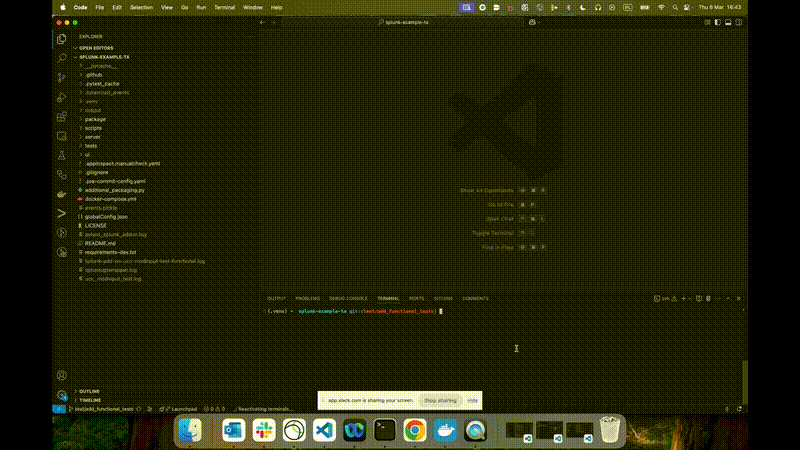

# Overview

addonfactory-ucc-test (AUT) is an open-source testing framework for functional tests for [UCC-based Splunk Add-ons](https://splunk.github.io/addonfactory-ucc-generator/) which allows to test add-ons functonality for data ingestion. It automates add-ons configuration, events generation by vendor product side and assessment of ingested events providing platform for end to end tests.


## Prerequisites

- Prepared basic setup for the add-on
    - Vendor product configured for the add-on
    - Splunk instance with add-on installed
    - The setup is manually tested
- [openapi.json](https://splunk.github.io/addonfactory-ucc-generator/openapi/#how-to-find-the-document) saved to developer workstation
- docker installed and started

## Installation

addonfactory-ucc-test can be installed via pip from PyPI:
```console
pip install addonfactory-ucc-test
```
You can verify installation by checking installed version:
```console
ucc-test-modinput --version
```

## How can I run existing tests?

If you just want to run existing functional tests developed with use of the framework:

1. make sure [the prerequisites](#prerequisites) are met and [addonfactory-ucc-test is installed](#installation)

2. export environment variables that describe your [Splunk instance](./addonfactory-ucc-test_pytest_plugin.md#expected-environment-variables) and the one specific for add-on you want to test (they should be described in `ucc_modinput_functional/README.md`)

3. run [`ucc-test-modinput gen`](./ucc-test-modinput_cli_tool.md)

4. run [`pytest tests/ucc_modinput_functional/`](./addonfactory-ucc-test_pytest_plugin.md#plugin-arguments)



## Writing all tests from scratch

Building a comprehensive test suite requires careful planning and adherence to best practices. Following paragraphs outlines the key aspects of starting from scratch, including the [Design Principles](./design_principles.md) that guide test architecture, the [Test Scenarios](./test_scenarios.md) that ensure coverage, important considerations [Before You Write Your First Line of Code](./before_you_write_your_first_line_of_code.md), and best practices [When You Write Your Tests](./when_you_write_your_tests.md).

That is a lot to read.

You want to start small and simple?

Check our [Hello World](./hello_world.md) example first.
